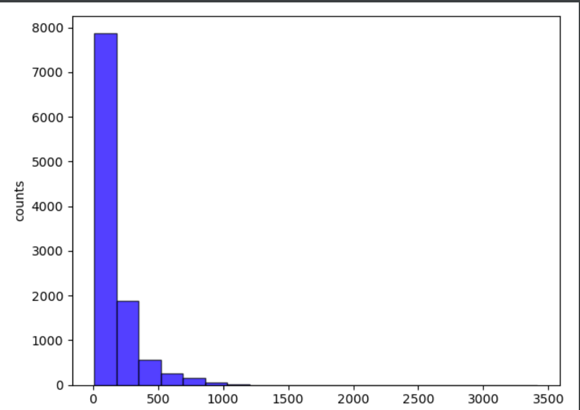
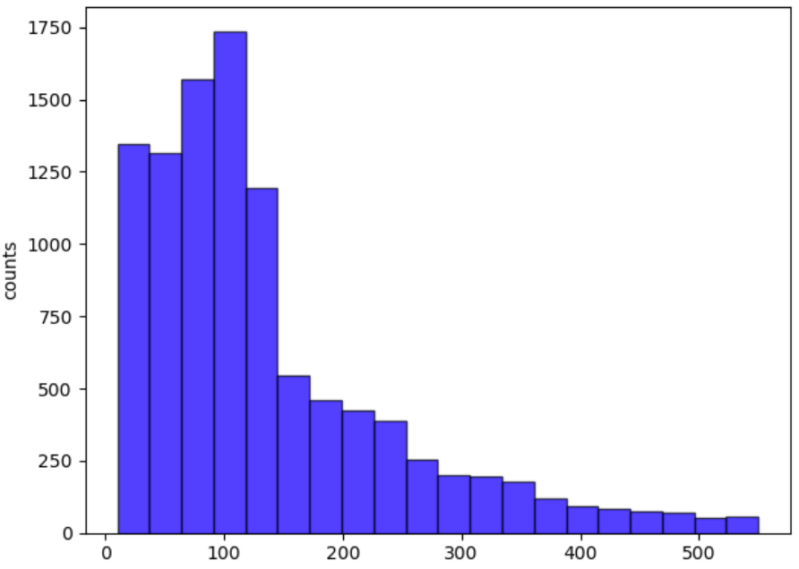

# reuters_classification

- 路透社语料库文本分类

### Data

- 原语料库90个类别，多标签分类。
- 针对`acq` (acqusitions 收购) 构建二分类器。

|            train            |            test            |            total            |
| :-------------------------: | :------------------------: | :-------------------------: |
|            7769             |            3019            |            10788            |
| `acq`: 1650 `not acq`: 6119 | `acq`: 719 `not acq`: 2300 | `acq`: 2369 `not acq`: 8419 |

- longest: 3417 words, shortest: 10 words, average length: 159.52

  

### ML methods

- Bag of Words + LinearSVC
  - Vocab: 26288 words
  - 10-folds validation acc: 0.979, test acc: 0.982

> ` sklearn.model_selection.cross_val_predict(svm_clf, train_x, train_label, cv=10)`
>
> 交叉验证，返回training data所有的预测label，将每一个样本作为test时的预测结果返回

- Tf-idf + LinearSVC
  - Vocab:  26147 words
  - 10-folds validation acc: 0.980, test acc: 0.985

- lda + LinearSVC
  - LDA num topics: 50
  - 10-folds validation acc: 0.942, test acc: 0.716
